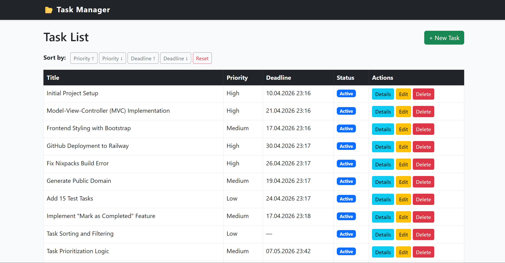
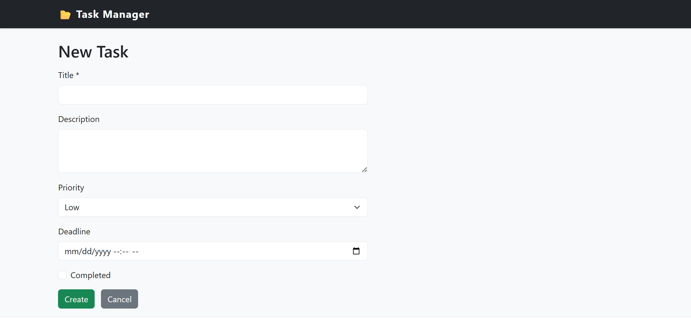
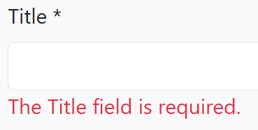
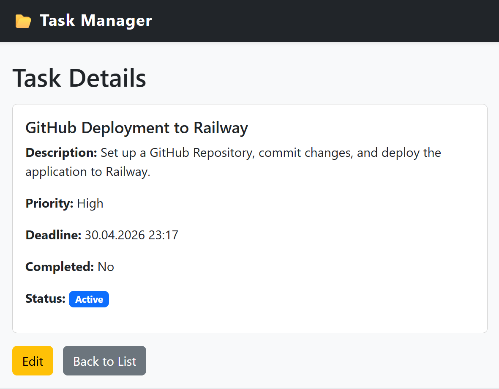
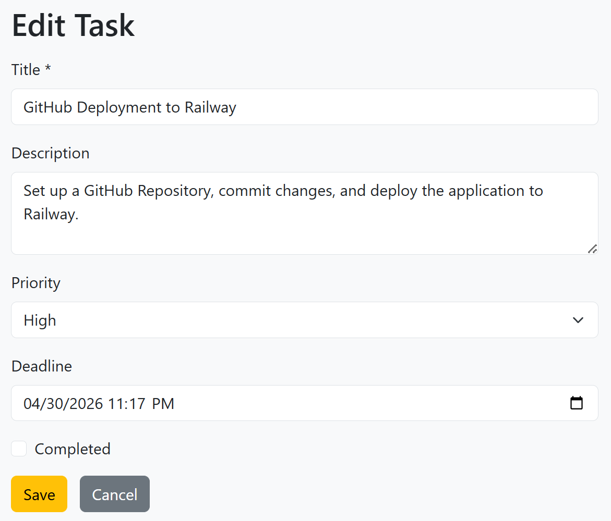
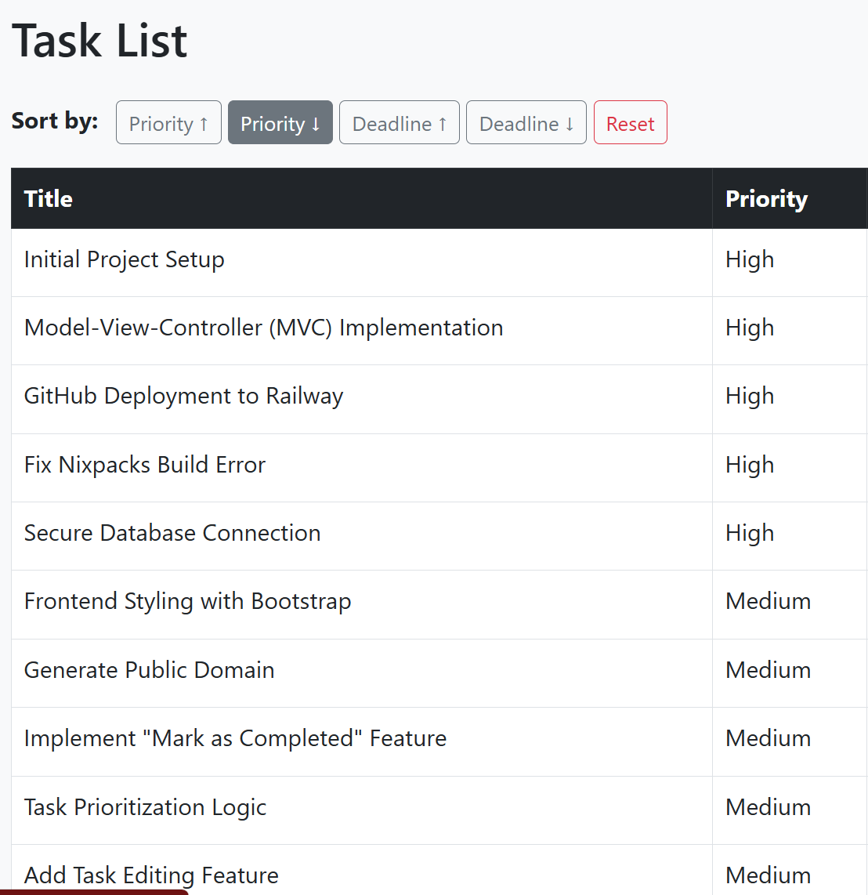

## Live Demo

🔗 https://aspnet-task-manager-production.up.railway.app/

---


# ASP.NET Core Task Manager

A task management web application built with ASP.NET Core MVC, 
developed as a technical assessment for the Digital Health Center 
of the Ministry of Health of Azerbaijan.

---

## Tech Stack

- **Backend:** ASP.NET Core MVC (.NET 10)
- **Database:** PostgreSQL 16
- **ORM:** Entity Framework Core
- **Architecture:** Clean Architecture (Core / Infrastructure / Service / Web)
- **Patterns:** Repository Pattern, Service Layer, Dependency Injection

---

## Features

- ✅ Create, Edit, Delete and view Tasks
- ✅ Task status calculated at runtime (no DB column):
  - `Done` — task is completed
  - `Overdue` — deadline has passed
  - `Urgent` — deadline within 24 hours
  - `Active` — everything else
- ✅ Sort by Priority (Low → Medium → High) and Deadline
- ✅ Manual validation (no DataAnnotations)
- ✅ Partial View for task list
- ✅ PostgreSQL with EF Core migrations

---

## Project Structure
TaskManager.sln
├── TaskManager.Core          # Models, Interfaces
├── TaskManager.Infrastructure # DbContext, Repositories
├── TaskManager.Service       # Business Logic
└── TaskManager.Web           # MVC Controllers, Views

---

## Getting Started

### Prerequisites
- .NET 10 SDK
- PostgreSQL 16

### Setup

1. Clone the repository:
```bash
   git clone https://github.com/AbdullaArif/aspnet-task-manager.git
   cd aspnet-task-manager
```

2. Update connection string in `TaskManager/appsettings.json`:
```json
   "ConnectionStrings": {
     "DefaultConnection": "Host=localhost;Port=5432;
     Database=TaskManagerDb;Username=postgres;Password="
   }
```

3. Apply migrations:
```bash
   cd TaskManager
   dotnet ef database update --project ../TaskManager.Infrastructure
```

4. Run the application:
```bash
   dotnet run
```

5. Open browser: `http://localhost:5000`

---
## Screanshoots 












---
## Author


**Arif Abdulla**  
Backend Engineer — .NET  
[GitHub](https://github.com/AbdullaArif) • 
[LinkedIn](https://linkedin.com/in/arifabdulla) • 
[arifabdulla.net](https://arifabdulla.net)

